# Hi!
> - Dias Akhmetbekov, $3^{th}$ year PhD.
> - Fields: Comparative Politics
> - Email: [da2669@nyu.edu](mailto:da2669@nyu.edu)
> - Office: 302

# Logistics (1): labs
> - Lab: Fridays, 2pm - 4pm EST, Room 435
> - Lab materials will be posted on the lab's GitHub repo: [https://github.com/AkhmetbekovDias/quant2-labs-spring2024](https://github.com/AkhmetbekovDias/quant2-labs-spring2024)
> - Office hours: by appointment 

# Logistics (2): homeworks
> - Homework due via email to Cyrus and me by the indicated deadline
> - Deadline is **strict**
> - Submit **PDF document** + **Code used**
>   - RMarkdown recommended
> - Code should be well commented 
> - Tables and plots format should be of high quality
> - Substantive answers should be presented in the written paragraphs
> - Ultimately, the goal is to learn how to **do** and **communicate** empirical research

#  DAG 
> - **DAG** is Directed Acyclic Graph 
>   - *Directed*: No reverse causality or simultaneity;
>   - *Acyclic*: No cycles
> - DAGs is a parsimonious representation of the qualitative aspects of
the data generating process
>   - Letters ($X$,$Z$,$Y$ etc.) are random variables;
>   - Arrows ($X\to Y$) denote a (possible) direct causal effect of $D$ on $Y$;
>   - no assumptions about the functional form or distribution.

# Simple DAG 

```{r, warning=FALSE, message=FALSE,echo=FALSE}
library(dagitty)
library(ggdag)
library(stargazer)
library(tidyverse)
model <- dagitty("dag{x->y; z->x; z->y}")
## coordinates for plotting
coordinates(model) <-  list(
  x = c(x=1, y=3, z=2),
  y = c(x=1, y=1, z=2))
## ggplot
ggdag(model) + theme_dag()
```

# Simulation


```{r, message=FALSE,warning=FALSE}
# set  seed
set.seed(1000)

# simulate data
n <- 1000
z <- rnorm(n)
x <- z + rnorm(n)
y <- x + z + rnorm(n)

# unconditional 
lm1 <- lm(y~x)
# conditional
lm2 <- lm(y~x+z)
```

# Simulation 
\tiny
```{r, warning=FALSE,message=FALSE}
stargazer(lm1,lm2, type = "text",
          column.labels = c("Biased unconditional",
                            "Unbiased Conditional"))
```

# More complex DAG

An example from the [Mixtape](https://mixtape.scunning.com/03-directed_acyclical_graphs) inspired by Becker (1994): 

\centering
{width=400}


# Collider Bias
\centering
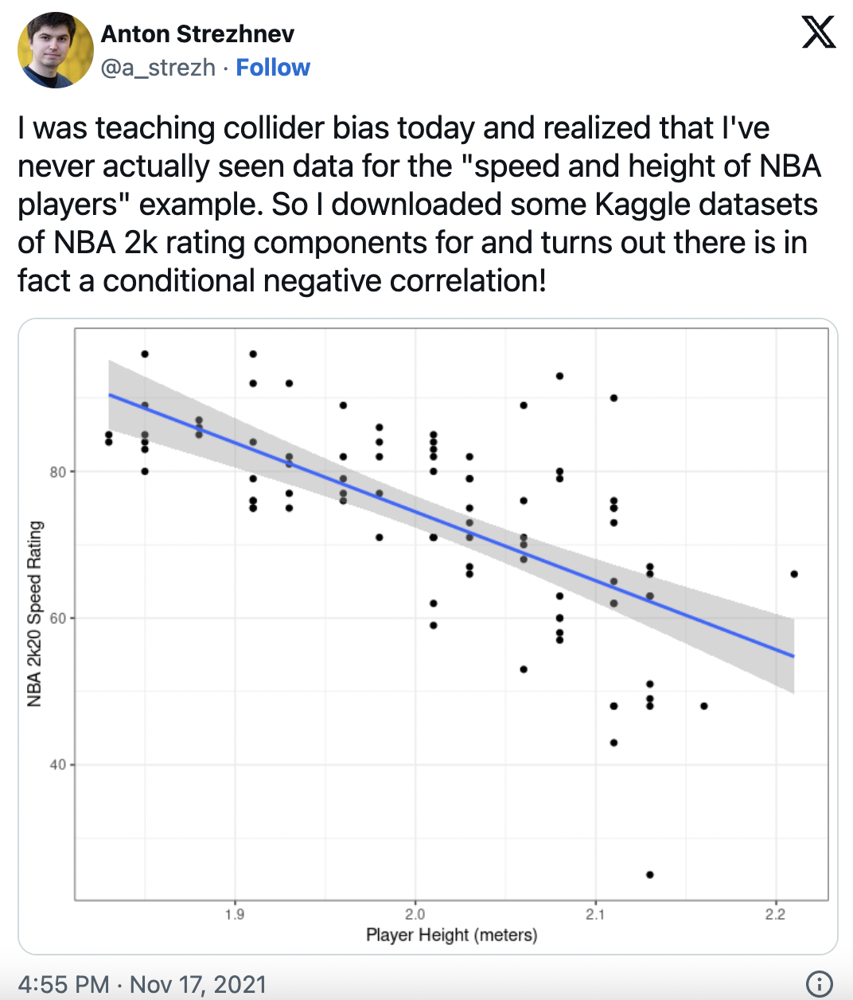{width=240}


# Collider bias 
\centering
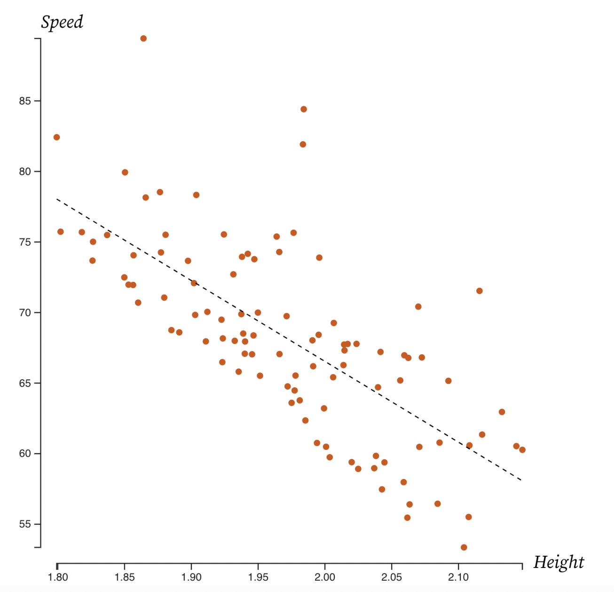{width=300}

# Collider bias 

\centering
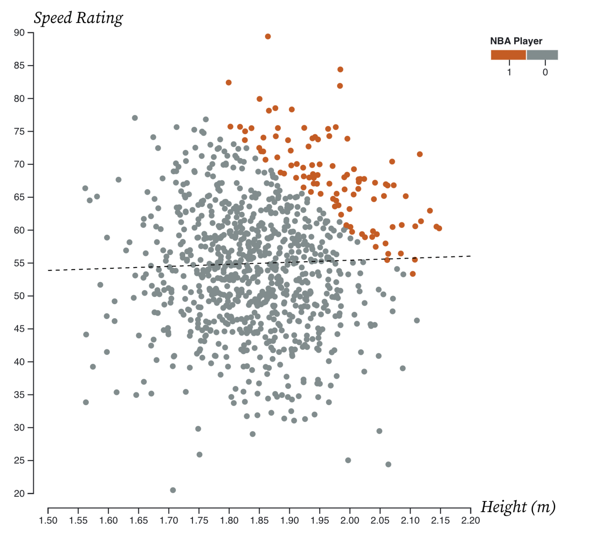{width=300}


# Collider bias 
\centering
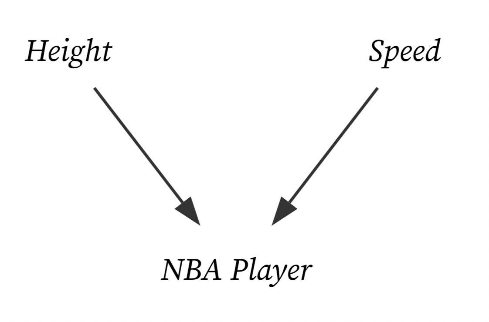{width=350}

# Collider bias 
\centering
{width=170}


# Collider bias 
\tiny
```{r, warning=FALSE,message=FALSE}
# Set seed
set.seed(123)

# Simulate  data
tb <- tibble(
  female = ifelse(runif(10000) >= 0.5, 1, 0),
  ability = rnorm(10000),
  discrimination = female,
  occupation = 1 + 2*ability + 0*female - 2*discrimination + rnorm(10000),
  wage = 1-1*discrimination + 1*occupation + 2*ability + rnorm(10000)
)

# Estimate regressions 
lm_1 <- lm(wage ~ female, tb)
lm_2 <- lm(wage ~ female + occupation, tb)
lm_3 <- lm(wage ~ female + occupation + ability, tb)
```


# Collider bias

\tiny
```{r}
# Compare
stargazer(lm_1, lm_2, lm_3, type = "text",
          column.labels = c("Biased unconditional",
                            "Biased",
                            "Unbiased Conditional"))

```


# Good Control

\centering
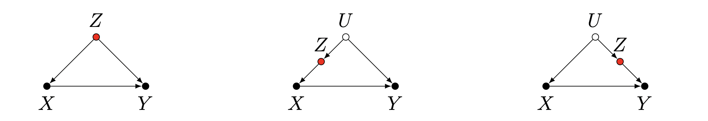{width=400}


# Good Control

\centering
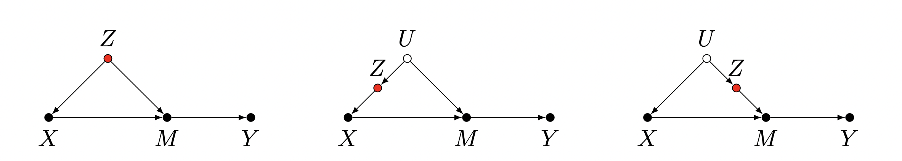{width=400}

# M-Bias

\centering
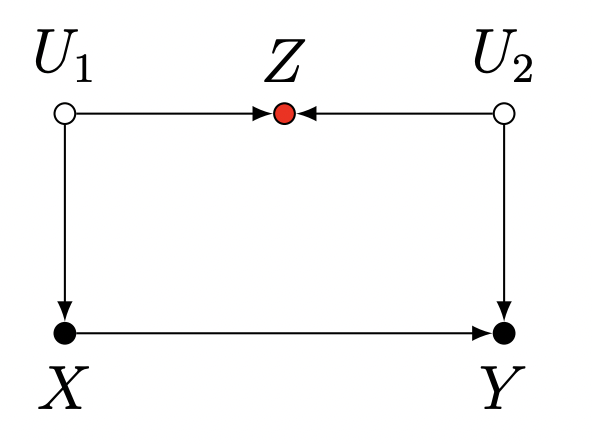{width=250}

# Damned if you do, damned if you don't

\centering
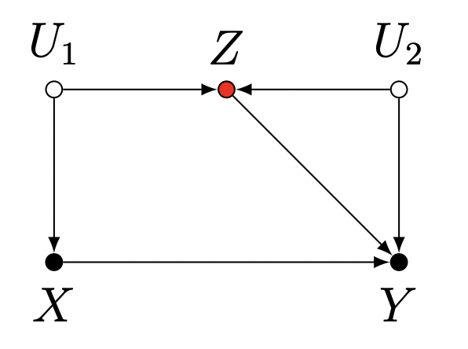{width=250}

# Neutral Control (or even good)

\centering
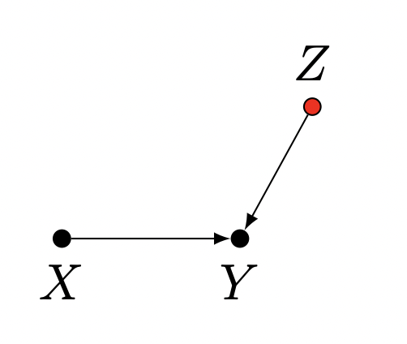{width=250}

# Neutral Control (or even bad)

\centering
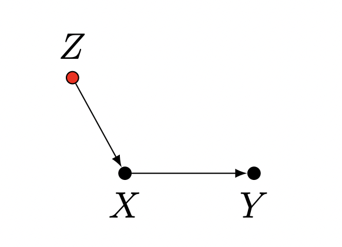{width=250}


# Bias Amplification

\centering
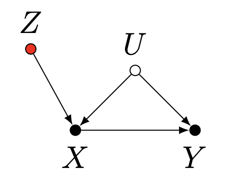{width=250}


# Overcontrol Bias

\centering
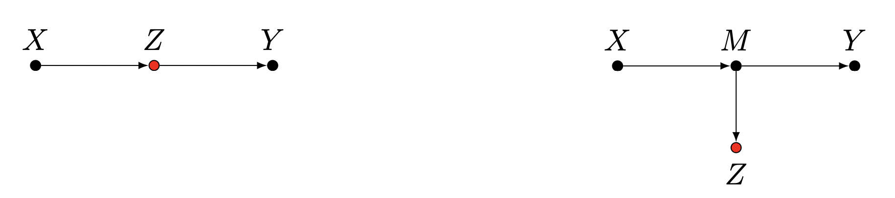{width=350}

# Neutral Control (or even good)

\centering
{width=250}

# Neutral Control (or even good in case of sample selection)

\centering
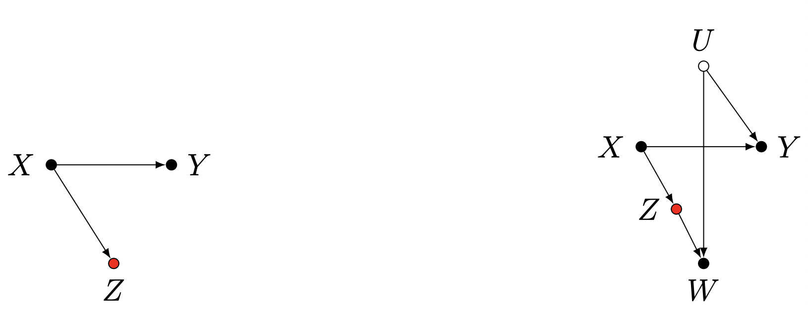{width=350}


# Colliding Bias

\centering
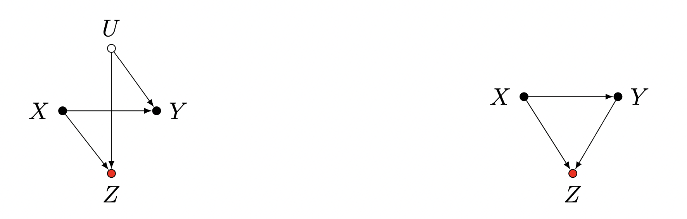{width=350}


# Potential Outcomes

> - **Potential outcomes** formally encode counterfactuals (Neyman-Rubin)
>   - $Y_{1i}$: outcome that unit $i$ would have if treated;
>   - $Y_{0i}$: outcome that unit $i$ would have if untreated;
> - Connect observed outcomes to potential outcomes (**consistency**)
>   - $Y_i = Y_i(D_i)$ we observe the potential outcome of observed treatment;
> - **Causal effect** for unit $i$: $\rho_i=Y_{1i}-Y_{0i}$
> - **Ignorability assumption**: $D_i \perp \!\!\! \perp (Y_{1i},Y_{0i})$


# Simulating Ignorability
\tiny
```{r,warning=FALSE,message=FALSE}
# Set random seed
set.seed(10003)

# Imagine we had a constant individual-level treatment effect
true_effect <- 2
# Our hypothetical population contains 1,000 units - imagine we could observe both Y(1) and Y(0)
N <- 1000 # Population size
dataset <- data.frame(Y0 = rnorm(N, mean = 0, sd = 3))
dataset$Y1 <- dataset$Y0 + true_effect 
```


# Simulating Ignorability
```{r, message=FALSE,warning=FALSE}
head(as_tibble(dataset))

```

# Simulating Ignorability
\tiny
```{r, message=FALSE,warning=FALSE}
# Randomized treatment (.5 probability of treatment)
dataset$D <- rbinom(N, 1, .5) # Not *exactly* half, but independent
# Treatment is a "light switch" - affects what we observe
dataset$Y <- dataset$Y1*dataset$D + dataset$Y0*(1-dataset$D)
# Let's see the data now
head(as_tibble(dataset))
```

# Simulating Ignorability
\tiny
```{r,message=FALSE,warning=FALSE}
simDataset <- dataset 
nIter <- 10000 # number of iterations to run
est_effect <- rep(NA, nIter) # placeholder
for (i in 1:nIter){
# randomly assign treatment again
simDataset$D <- rbinom(N, 1, .5)
# observed outcome
simDataset$Y <- simDataset$Y1*simDataset$D + simDataset$Y0*(1-simDataset$D)
# difference-in-means
est_effect[i] <- mean(simDataset$Y[simDataset$D == 1]) -
mean(simDataset$Y[simDataset$D == 0])
}
# What's the average of treatment effect estimates in repeated samples
mean(est_effect)
```


# Simulating Ignorability
\tiny
```{r, message=FALSE,warning=FALSE}
hist(est_effect, xlab="ATE Estimate", ylab="Frequency", main="Histogram of difference-in-means\nsampling distribution")
abline(v=true_effect, col="red", lty=2, lwd=2)
```


# Simulating Ignorability
\tiny
```{r, message=FALSE,warning=FALSE}
newDataset <- dataset # placeholder to not override dataset
# Probability of treatment depends on $Y(1)$
newDataset$D <- rbinom(N, 1, pnorm(newDataset$Y1)) 
#pnorm is the normal CDF - high positive values = high probabilities
#what is the probability that each observation in our dataset will be assigned to treatment?
quantile(pnorm(newDataset$Y1))
#now how many units are treated?
mean(newDataset$D)
```


# Simulating Ignorability 
\tiny

```{r,warning=FALSE,message=FALSE}
newSimDataset <- newDataset 
nIter <- 10000 # number of iterations to run
est_effect_bias <- rep(NA, nIter) # placeholder
for (i in 1:nIter){
  # non-randomly assign treatment (High Y(1) more likely to be treated)
  newSimDataset$D <- rbinom(N, 1, pnorm(newSimDataset$Y1))
  # observed outcome
  newSimDataset$Y <- newSimDataset$Y1*newSimDataset$D + newSimDataset$Y0*(1-newSimDataset$D)
  # difference-in-means
  est_effect_bias[i] <- mean(newSimDataset$Y[newSimDataset$D == 1]) -
                          mean(newSimDataset$Y[newSimDataset$D == 0])
}
# What's the average of treatment effect estimates in repeated samples
mean(est_effect_bias)
```

# Simulating ignorability
\tiny

```{r,message=FALSE,warning=FALSE}
hist(est_effect_bias, xlab="ATE Estimate", ylab="Frequency", main="Histogram of difference-in-means\n w/ selection-into-treatment")
abline(v=true_effect, col="red", lty=2, lwd=2)
abline(v=mean(est_effect_bias), col="blue", lty=2, lwd=2)
```

# Conclusions

> - Control for **confounders** / do not control for **colliders**;
> - Not all **pre-treatment** covariates are good controls;
> - Not all **post-treatment** covariates are bad controls; 
> - Difference-in-means is an **unbiased estimator** of average treatment effect (ATE) under completely random assignment condition. 


